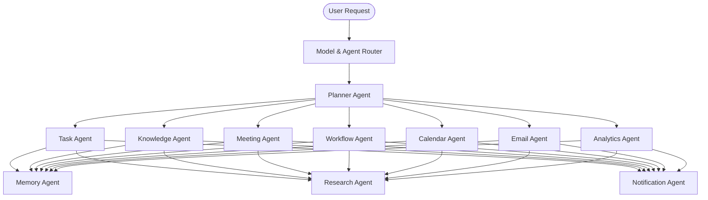
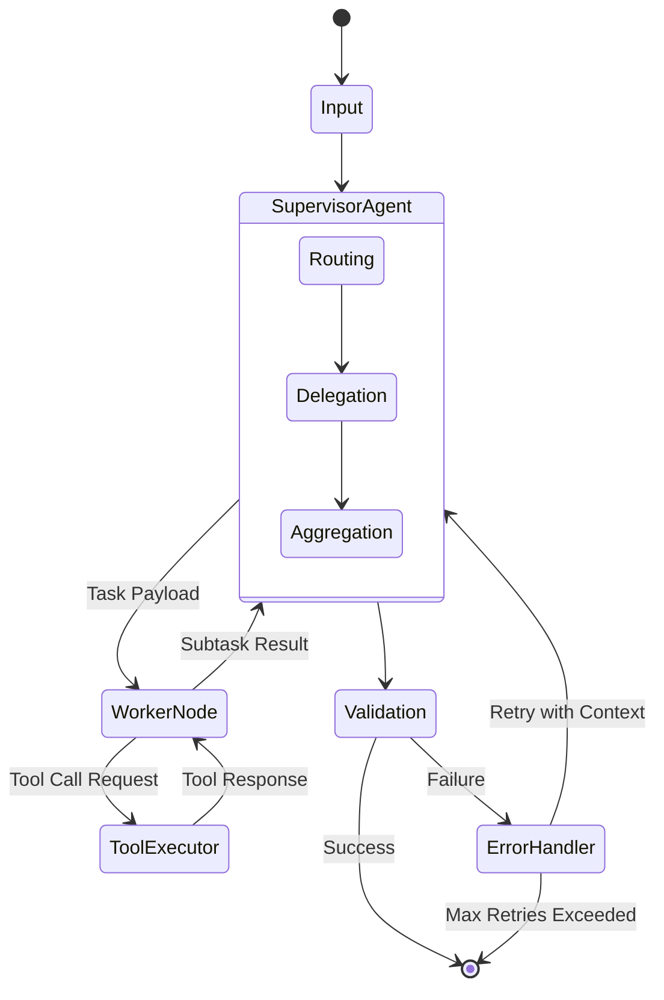
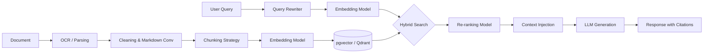

# NeuroFlow AI: Complete AI Architecture Documentation

"Your Autonomous AI Productivity Operating System"

## 1. AI Overview

### Vision
NeuroFlow AI is not a simple chatbot; it is a proactive, autonomous AI Operating System designed to augment human productivity. It functions as a cognitive layer that anticipates needs, orchestrates complex workflows, and retrieves knowledge autonomously.

### Goals
- **Proactivity:** Automate routine tasks without explicit user prompting.
- **Accuracy:** Ensure 99.9% factual accuracy via robust RAG and grounding.
- **Context-Awareness:** Maintain long-term user memory and project state.
- **Efficiency:** Route queries intelligently to optimize for cost and latency.

### AI Layers
| Layer | Description | Technologies |
|---|---|---|
| **Reasoning Layer** | The core logic engine that decomposes tasks and orchestrates multi-step planning. | LangGraph, Gemini Pro |
| **Execution Layer** | Executes tool calls, API interactions, and script execution. | FastAPI, Python Tool Bindings |
| **Memory Layer** | Stores and retrieves short-term (contextual) and long-term (episodic) data. | Redis, PostgreSQL (JSONB) |
| **Knowledge Layer** | Semantic search and RAG engine for user documents and integrations. | pgvector, Qdrant |
| **Planning Layer** | Long-term objective tracking and goal decomposition. | LangChain Plan-and-Solve |

---

## 2. Multi-Agent System

NeuroFlow utilizes a specialized Multi-Agent System (MAS) architecture, where domain-specific agents collaborate to solve complex user requests.



### Agent Definitions

#### 1. Planner Agent
- **Purpose:** The central orchestrator (Supervisor) that receives complex tasks and delegates subtasks.
- **Responsibilities:** Task decomposition, dependency mapping, result aggregation.
- **Input:** Natural language requests.
- **Output:** Execution graph and delegated tasks to sub-agents.
- **Failure Handling:** Re-plans if a sub-agent fails; asks user for clarification if ambiguous.

#### 2. Task Agent
- **Purpose:** Manages the user's to-do list and project states.
- **Responsibilities:** Creating, updating, and prioritizing tasks based on deadlines and context.
- **Input:** Planner directives (e.g., "Extract action items and add to Project X").
- **Output:** Database mutation confirmations.
- **Failure Handling:** Validation fallback if task format is invalid.

#### 3. Knowledge Agent
- **Purpose:** Handles all RAG and semantic retrieval.
- **Responsibilities:** Querying pgvector/Qdrant, synthesizing document answers.
- **Input:** Semantic queries.
- **Output:** Grounded answers with citations.
- **Failure Handling:** Returns "Information not found" to prevent hallucination.

#### 4. Meeting Agent
- **Purpose:** Processes meeting transcripts and recordings.
- **Responsibilities:** Summarization, action item extraction, sentiment analysis.
- **Input:** Transcript text or audio files.
- **Output:** Structured meeting notes and delegated tasks.
- **Failure Handling:** Requests human review for low-confidence audio transcripts.

#### 5. Workflow Agent
- **Purpose:** Automates multi-step integration sequences.
- **Responsibilities:** Executing Zapier-like workflows via internal tools.
- **Input:** Trigger events (e.g., "When email arrives...").
- **Output:** Execution status and logs.
- **Failure Handling:** Retry with exponential backoff; dead-letter queue.

#### 6. Calendar Agent
- **Purpose:** Schedules and optimizes time.
- **Responsibilities:** Finding time slots, resolving conflicts, time-blocking focus work.
- **Input:** Scheduling requests.
- **Output:** Calendar API payloads.
- **Failure Handling:** Proposes alternative slots if conflict cannot be resolved.

#### 7. Email Agent
- **Purpose:** Drafts and manages communications.
- **Responsibilities:** Auto-drafting replies, sorting inbox urgency.
- **Input:** Email threads.
- **Output:** Draft text or API send commands.
- **Failure Handling:** Drafts saved to "Review" folder; never auto-sends without explicit permission.

#### 8. Analytics Agent
- **Purpose:** Provides insights on user productivity.
- **Responsibilities:** Querying database for metrics (e.g., time spent, tasks completed).
- **Input:** Natural language questions (e.g., "How productive was I this week?").
- **Output:** Charts, tables, and text summaries.
- **Failure Handling:** Defaults to pre-calculated dashboard metrics on query failure.

#### 9. Memory Agent
- **Purpose:** Manages context persistence.
- **Responsibilities:** Reading/Writing to user memory stores.
- **Input:** Observations from other agents.
- **Output:** Context snippets injected into prompts.
- **Failure Handling:** Graceful degradation to stateless interactions.

#### 10. Research Agent
- **Purpose:** Deep-dives into the web for external information.
- **Responsibilities:** Web scraping, search engine querying, synthesis.
- **Input:** Web search queries.
- **Output:** Summarized research reports.
- **Failure Handling:** Timeout limits and fallback to LLM base knowledge.

#### 11. Notification Agent
- **Purpose:** Determines when and how to interrupt the user.
- **Responsibilities:** Routing alerts to Push, Email, or in-app based on urgency.
- **Input:** System events.
- **Output:** Triggered notifications.
- **Failure Handling:** Batches non-critical notifications on failure.

---

## 3. Agent Orchestration (LangGraph)

NeuroFlow utilizes **LangGraph** to build stateful, cyclical, and multi-actor LLM applications.



- **Routing:** The Supervisor (Planner) uses LLM reasoning to determine which agents are required based on the schema of tools available.
- **Decision Making:** Uses a ReAct (Reason + Act) loop to evaluate intermediate steps before proceeding.
- **Task Delegation:** Pushes state to worker nodes via LangGraph state channels.
- **Retries:** Configured with exponential backoff. If an LLM outputs malformed JSON, a specific output parser node catches it and prompts the LLM to fix the formatting.
- **Fallback:** If complex agents fail, the system falls back to a simpler QA model to inform the user of the system state.

---

## 4. RAG Architecture

The Retrieval-Augmented Generation pipeline ensures NeuroFlow operates on the user's private data securely and accurately.



- **Document Upload:** Supports PDF, DOCX, TXT, CSV via FastAPI endpoints.
- **OCR:** Tesseract/Google Cloud Vision for scanned documents.
- **Parsing/Cleaning:** Unstructured.io for extracting clean text, tables, and removing boilerplate.
- **Chunking:** Semantic chunking (respecting paragraph/sentence boundaries) with 512 token overlap.
- **Embedding:** Google Vertex AI text-embedding-gecko or OpenAI text-embedding-3-small.
- **Vector Database:** PostgreSQL with `pgvector` for integrated relational+vector queries.
- **Hybrid Search:** Combines dense vector search (semantic) with BM25 sparse search (keyword) via Postgres extensions or Qdrant.
- **Ranking:** Cross-encoder models (Cohere Rerank) to sort the top 20 retrieved chunks down to the top 5 most relevant.
- **Citation:** Strict prompting forcing the LLM to output `[Source: Doc_Name, Page X]`.

---

## 5. Memory Architecture

NeuroFlow maintains a human-like memory hierarchy.

- **Short-Term Memory (Session):** Managed in Redis. Holds the last 10-20 turns of conversation. Extremely fast, expires after 24 hours of inactivity.
- **Long-Term Memory (User):** Managed in PostgreSQL via Memory Agent. Extracts key facts ("User prefers bullet points", "User manages Team X") and stores them as key-value pairs or semantic vectors.
- **Conversation Memory:** Infinite scroll history stored in PostgreSQL, compressed periodically.
- **Project Memory:** Aggregated summaries of active projects injected into the system prompt when working within a project context.
- **Context Window Strategy:** Dynamic context assembly. Base Prompt (500 tokens) + User Memory (200 tokens) + Short-term Chat (1000 tokens) + RAG Chunks (4000 tokens).
- **Memory Expiry:** Configurable TTL for temporary facts; manual flush available for users.

---

## 6. Prompt Engineering

NeuroFlow uses modular, highly-structured system prompts (typically YAML or XML formatted for LLM parsing efficiency).

**Example System Prompt Architecture:**
```xml
<neuroflow_system>
  <role>You are NeuroFlow, an elite autonomous AI productivity OS.</role>
  <guidelines>
    - Be concise and direct.
    - Never hallucinate facts.
    - Do not assume information; use tools to fetch state.
  </guidelines>
  <context>
    <user_preferences>{user_preferences}</user_preferences>
    <current_datetime>{datetime}</current_datetime>
  </context>
</neuroflow_system>
```

- **Planner Prompt:** Highly structural, asking for JSON output of action plans.
- **Meeting Prompt:** Focused on extracting `[Decisions]`, `[Action Items]`, and `[Summary]`.
- **Knowledge Prompt:** Strict instructions: "Answer ONLY using the provided <context>. If the answer is not present, state 'I do not have this information'."

---

## 7. Tool Calling

Tools are implemented as Python functions with Pydantic schemas using FastAPI.

| Tool | Purpose | Schema/Input |
|---|---|---|
| **Calendar Tool** | Schedule events, check availability. | `start_time, end_time, attendees, title` |
| **Task Tool** | CRUD operations on tasks. | `action, task_id, title, priority, status` |
| **Knowledge Tool** | Semantic search across user docs. | `query_string, filters (date, tags)` |
| **Workflow Tool** | Trigger background automations. | `workflow_id, parameters_json` |
| **Search Tool** | External web search (Tavily/SerpAPI). | `search_query` |
| **Meeting Tool** | Fetch transcripts or summaries. | `meeting_id, extraction_type` |
| **Notification Tool** | Push alerts to the user. | `message, urgency_level, channels` |

---

## 8. Model Router

To balance cost, speed, and intelligence, NeuroFlow dynamically routes queries.

```mermaid
flowchart TD
    Req[Incoming Request] --> Classifier[Intent Classifier]
    Classifier --> |Simple Chat / UI Action| Flash[Gemini 1.5 Flash]
    Classifier --> |Complex Reasoning / Coding| Pro[Gemini 1.5 Pro]
    Classifier --> |Deep Research / Long Context| Ultra[Gemini 1.5 Pro (1M Context)]
```

- **Gemini 1.5 Flash:** Used for fast tool calling, formatting, short chat, and simple task routing. (Low latency, low cost).
- **Gemini 1.5 Pro:** Used for the Supervisor Planner agent, heavy RAG synthesis, and meeting summarization. (High intelligence).
- **Cost Optimization:** Summarization of old chat histories uses Flash to compress context before feeding into Pro.
- **Fallback Models:** If Google APIs experience downtime, the router seamlessly fails over to OpenAI (GPT-4o) or Anthropic (Claude 3.5 Sonnet) if configured.

---

## 9. AI Workflows

**Example: Task Planning Workflow**
1. User: "Plan my product launch for next week."
2. **Planner Agent** parses request -> Delegates to **Task Agent**.
3. **Task Agent** uses LLM to generate a Work Breakdown Structure (WBS).
4. **Task Agent** executes `create_task` tool 15 times for subtasks.
5. **Planner Agent** delegates to **Calendar Agent**.
6. **Calendar Agent** executes `find_slots` tool and time-blocks the high-priority subtasks.
7. **Planner Agent** summarizes actions and reports back to user.

---

## 10. Safety & Guardrails

- **Hallucination Prevention:** Strict prompt engineering combined with a dedicated "Validator" LangGraph node that double-checks citations against the source text before returning the answer.
- **Grounding:** All knowledge queries must map to a `chunk_id` in pgvector.
- **Confidence Scores:** Model outputs a confidence score (0.0-1.0). If < 0.7 on factual queries, it triggers a warning or requests a web search.
- **Guardrails:** NeMo Guardrails implemented to block prompt injections, jailbreaks, and off-topic conversations (e.g., preventing the enterprise OS from acting like a pirate).
- **RBAC Enforcement:** AI tools respect backend JWT claims. The AI cannot query documents the user does not have permission to view.

---

## 11. AI Observability

NeuroFlow integrates with tools like **LangSmith** or **Phoenix Arize** for AI telemetry.

- **Prompt Logs:** Every prompt and completion is logged for debugging.
- **Latency Tracking:** Time-to-First-Token (TTFT) and total generation time monitored via Prometheus.
- **Token Usage:** Input/Output tokens tracked per user and per project for cost attribution.
- **Cost Tracking:** Dashboard displaying real-time API spend.
- **Evaluation:** Offline evaluation pipelines using LLM-as-a-judge to measure RAG accuracy on golden datasets before deploying prompt changes.

---

## 12. AI Architecture Review

### Why This Architecture is Production-Ready
1. **Separation of Concerns:** Using a Multi-Agent System (LangGraph) prevents a single monolithic prompt from failing under complex instructions. Each agent is highly specialized.
2. **Scalability:** The architecture is decoupled. Vector search (pgvector), fast memory (Redis), and LLM orchestration (FastAPI) scale independently.
3. **Cost-Efficiency:** The Model Router ensures expensive models (Gemini Pro) are only used for heavy reasoning, while fast models (Gemini Flash) handle UX interactions.
4. **Resilience:** Built-in retries, fallback models, and exponential backoff ensure high availability.

### Potential Weaknesses & Mitigations
- **Weakness:** LangGraph cyclical loops can theoretically run infinitely, racking up costs.
  - **Improvement:** Implement strict `max_steps` limits on all agent loops (e.g., max 5 iterations).
- **Weakness:** Hybrid search tuning can be difficult; semantic search often misses exact ID/keyword matches.
  - **Improvement:** Use Self-Query Retrievers (converting natural language to SQL/metadata filters) before falling back to vector similarity.
- **Weakness:** LLM latency can frustrate users in a snappy UI.
  - **Improvement:** Extensively utilize streaming (Server-Sent Events) from FastAPI to the React frontend, so the user sees thoughts and tokens in real-time.
