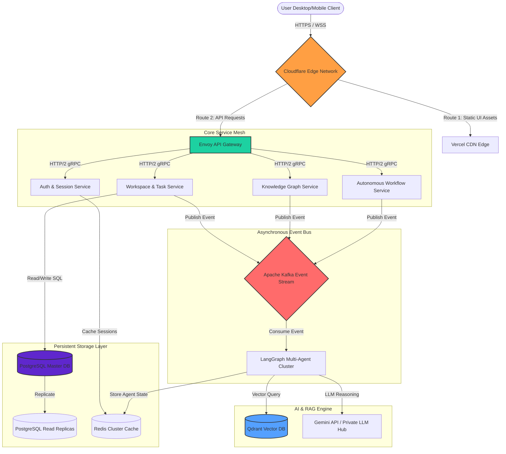
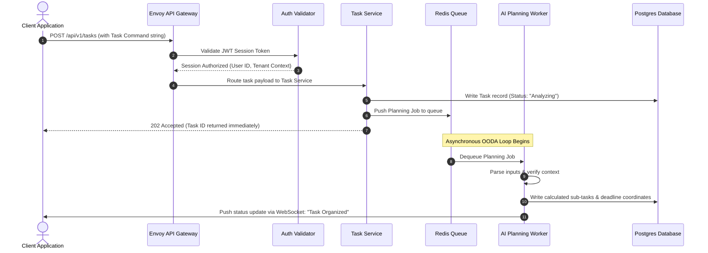
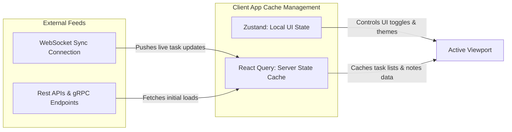
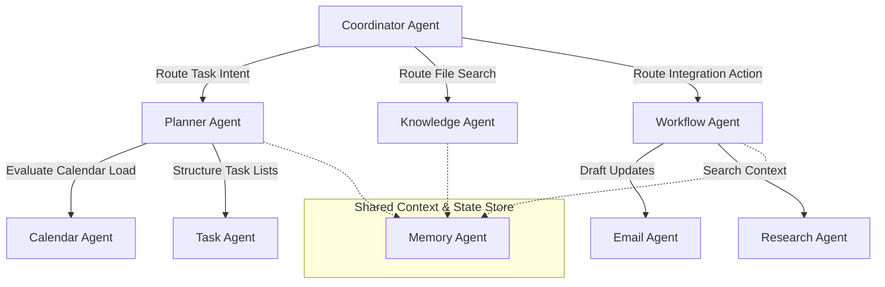
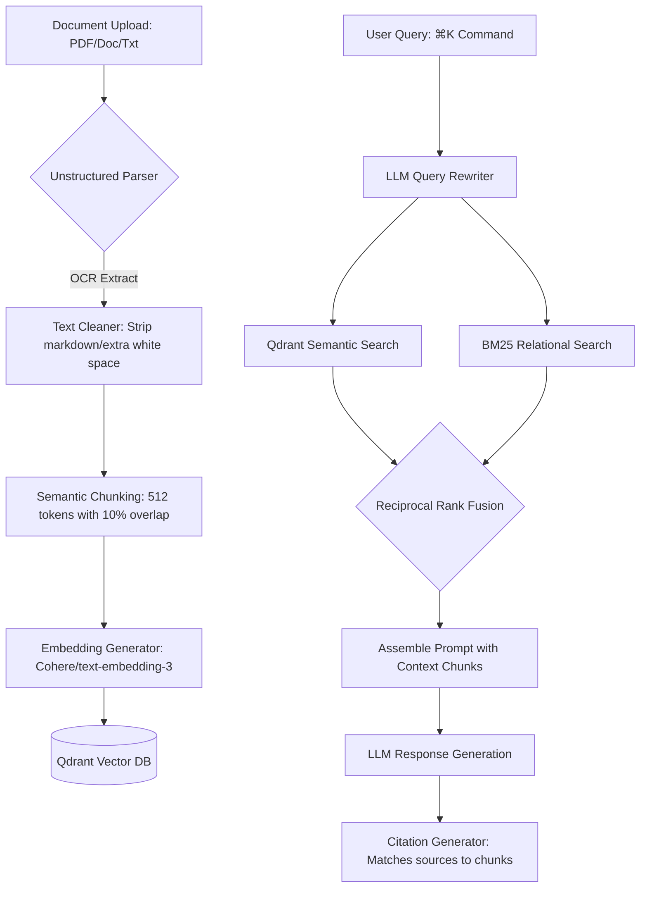
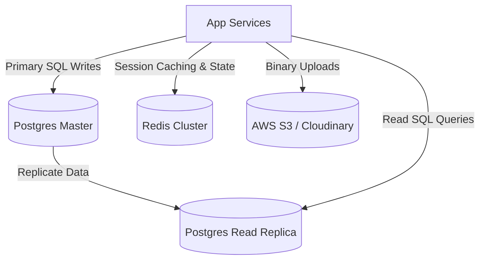
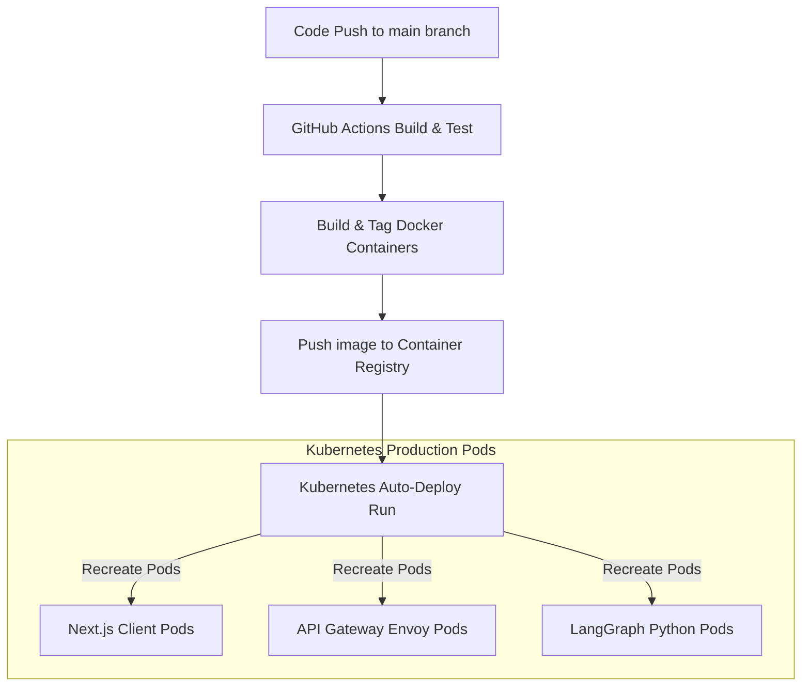
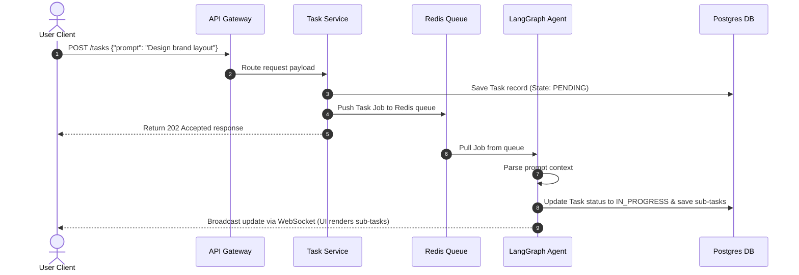
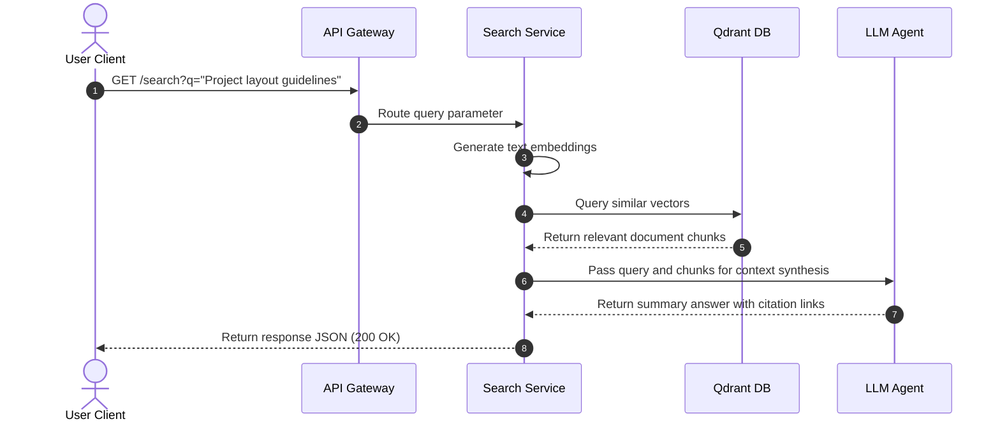
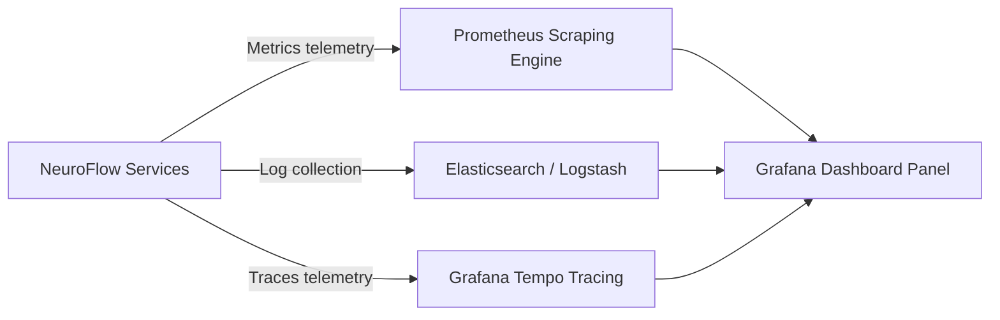

# Enterprise System Architecture Document
## NeuroFlow AI: Your Autonomous AI Productivity Operating System

---

## 1. High-Level Architecture

### 1.1 Global System Diagram

NeuroFlow AI uses a decoupled, event-driven microservices architecture optimized for sub-100ms API operations and scalable multi-agent AI execution loops.



---

### 1.2 Request Lifecycle



---

### 1.3 Application Architecture Layers

1.  **Gateway Layer**: Cloudflare CDN manages SSL offloading, global edge caching, and DDoS shielding. Envoy API Gateway validates requests, decrypts tokens, manages rate limits, and routes traffic.
2.  **Business Layer**: Modular Node.js and Go microservices handling task tracking, calendars, notification queues, and document management.
3.  **AI Execution Layer**: A dedicated cluster of Python processes running LangGraph. These agents run asynchronous OODA (Observe-Orient-Decide-Act) scheduling loops, construct workflows, and query vectors.
4.  **Storage Layer**:
    *   **PostgreSQL**: Handles relational data (users, permissions, task status, workspace structures).
    *   **Redis Cluster**: Manages session state caches, locks, and agent memory tables.
    *   **Qdrant**: High-density Vector DB mapping document chunk embeddings.
5.  **Infrastructure Layer**: Kubernetes (EKS/GKE) managing auto-scaling pods, isolated database networks, and secret storage managers.

---

## 2. Frontend Architecture

### 2.1 Next.js App Router Structure
The frontend application uses a clean Next.js App Router structure built for fast page loads and visual consistency.

```
src/
├── app/
│   ├── (auth)/
│   │   ├── login/page.tsx           # Authentication Screen
│   │   └── onboarding/page.tsx      # Persona survey & tool integration setup
│   ├── (dashboard)/
│   │   ├── layout.tsx               # Main Sidebar HUD Layout
│   │   ├── page.tsx                 # Core Dashboard Workspace
│   │   ├── planner/page.tsx         # Drag-and-Drop Calendar view
│   │   ├── vault/page.tsx           # Spatial Knowledge graph explorer
│   │   └── workflows/page.tsx       # Automation Canvas interface
│   ├── api/                         # Next.js API Routes for edge validation
│   ├── layout.tsx                   # Font configurations & layout wrappers
│   └── providers.tsx                # Context providers (Auth, Theme, QueryClient)
```

---

### 2.2 Global State and Caching Strategy



*   **Zustand**: Manages local UI states (active panels, theme choices, Command Center toggles).
*   **React Query**: Manages server state caches, syncs data in the background, handles optimising UI edits, and invalidates out-of-date records.
*   **WebSocket Engine**: Maintains connection threads to push real-time task additions and scheduling shifts directly to client views.

---

## 3. Backend Architecture

### 3.1 Microservices Distribution

```
                       +-----------------------------------+
                       |          ENVOY API GATEWAY        |
                       +-----------------+-----------------+
                                         |
    +-------------------+----------------+------------------+-------------------+
    |                   |                |                  |                   |
    v                   v                v                  v                   v
+---+---------+   +-----+-----+   +------+------+   +-------+---+   +-----------+---+
| Auth & User |   | Task Mgmt |   | Calendar API|   | Knowledge |   | Workflow  |   |
| Service     |   | Service   |   | Service     |   | Service   |   | Engine    |   |
+---+---------+   +-----+-----+   +------+------+   +-------+---+   +-----------+---+
    |                   |                |                  |                   |
    +-------------------+----------------+------------------+-------------------+
                                         |
                                         v
                       +-----------------+-----------------+
                       |         REDIS EVENT BUS           |
                       +-----------------+-----------------+
                                         |
                                         v
                       +-----------------+-----------------+
                       |         LANGGRAPH WORKER          |
                       +-----------------------------------+
```

### 3.2 Services Catalog & Communication Details

*   **Auth Service**: Handles OAuth validations and session creation. Uses fast symmetric token signatures.
*   **Task Service**: Manages CRUD logic for tasks. Writes to PostgreSQL, updates caches, and broadcasts changes.
*   **Calendar Service**: Syncs calendar events via webhooks. Adjusts schedules dynamically when updates occur.
*   **Knowledge Service**: Ingests files, runs OCR pipelines, parses documents, and updates vector databases.
*   **Workflow Service**: Translates user logic requests into executable automation tasks.
*   **Meeting Service**: Transcribes live meeting audio, parses action items, and syncs updates to task boards.
*   **Analytics Service**: Computes focus scores and productivity metrics in the background.
*   **AI Service**: Manages prompts, formats vector contexts, and routes queries to LLMs.

---

### 3.3 Service Communication Protocols
*   **Synchronous Routes**: Services communicate using **gRPC over HTTP/2** to minimize network overhead and ensure fast responses.
*   **Asynchronous Routes**: Uses **Kafka / Redis Streams** for task additions, calendar changes, and document parsing events to prevent thread blockages.

---

## 4. AI Architecture

NeuroFlow AI uses a multi-agent system powered by **LangGraph**. The system runs OODA decision-making loops to complete complex tasks autonomously.



### 4.1 Agent Catalog

*   **Coordinator Agent**: The primary gateway agent. Parses natural language, extracts target intent, and routes tasks to specialized agents.
*   **Planner Agent (OODA Scheduler)**: Analyzes user calendars and task priorities to schedule focus blocks.
*   **Task Agent**: Breaks large objectives into detailed sub-task lists.
*   **Knowledge Agent**: Handles vector searches, document parsing, and updates node connections in the Knowledge Vault.
*   **Calendar Agent**: Interacts with Google and Outlook APIs to resolve schedule conflicts.
*   **Research Agent**: Scrapes web sources to supplement internal search queries.
*   **Email Agent**: Drafts contextual responses tailored to the user's communication style.
*   **Workflow Agent**: Executes multi-step API automations.
*   **Memory Agent**: Manages user preference tables, caching history to personalize future completions.

---

### 4.2 State Management and Recovery Flow

*   **State Store**: Agent states are stored in Redis as thread-safe JSON files, allowing agents to resume execution if a step fails.
*   **Failure Recovery Loop**:
    1. If an agent execution step fails, the system retry loop triggers (max retries: 3).
    2. If the failure persists, the error is caught, and the task falls back to a simpler LLM model (e.g., switching from a complex reasoning model to a faster context model).
    3. If the fallback route fails, the system pauses execution, logs the error, and notifies the user: *"Workflow paused due to connection issues. Tap to retry."*

---

## 5. RAG Architecture

Our RAG (Retrieval-Augmented Generation) pipeline processes uploaded documents and retrieves relevant context with high semantic precision.



### 5.1 RAG Processing Steps

1.  **Ingestion & Parsing**: Documents pass through an ingestion service. Scanned PDFs are processed using OCR tools to extract raw text content.
2.  **Semantic Chunking**: Instead of hard character cuts, documents are partitioned based on semantic structure. Each chunk is set to 512 tokens with a 10% overlap to preserve context across paragraphs.
3.  **Embeddings**: Chunks are processed into 1536-dimensional vectors using embedding models, which are then indexed in Qdrant with HNSW configurations.
4.  **Retrieval**: Queries are optimized using an LLM query rewriter. The search system runs a hybrid retrieval pass matching BM25 keyword results with cosine vector similarity scores.
5.  **Context Injection**: The top 5 retrieved chunks are compiled with system instructions and sent to the reasoning model, which returns answers containing citation tags referencing source files.

---

## 6. Security Architecture

NeuroFlow AI is built to protect user data privacy across all layers of the platform.

```
       +--------------------------------------------------------+
       |             ENTERPRISE SECURITY PROTOCOL               |
       +--------------------------------------------------------+
       |   - AES-256 Encryption at rest                         |
       |   - TLS 1.3 Encryption in transit                      |
       |   - Key Management: HashiCorp Vault / AWS KMS          |
       |   - Session Control: JWT with Redis blocklist expiry   |
       +--------------------------------------------------------+
```

### 6.1 Security Configurations

*   **Authentication & Session Control**: Sessions are managed with short-lived JWT tokens (15-minute expiry) paired with longer-lived refresh tokens stored in HTTP-only cookies.
*   **Role-Based Access Control (RBAC)**: APIs validate request permissions against a strict RBAC matrix (Admin, Member, Guest) before executing database operations.
*   **Data Encryption**: User databases are encrypted using AES-256 keys managed by KMS engines. Data in transit is encrypted using TLS 1.3.
*   **Secrets Storage**: API credentials and database access keys are managed dynamically using HashiCorp Vault.
*   **Rate Limiting**: API pathways are protected by rate limiters (100 requests per minute per IP) to prevent denial-of-service attempts.

---

## 7. Storage Architecture



### 7.1 Database Roles & Caching Rules

*   **PostgreSQL (Relational Store)**: Configured in a primary-replica structure. Write requests route to the primary database, while read requests are distributed across read-replicas to maximize performance.
*   **Redis Cluster**: Handles session caching, job queues, and API rate limiting.
*   **Object Storage (S3 / Cloudinary)**: Stores PDF uploads, meeting audio files, and user media securely.
*   **Point-in-Time Recovery**: Relational databases execute incremental backups every 6 hours, with full database snapshots preserved weekly.

---

## 8. Deployment Architecture

Our cloud infrastructure uses containerized deployment pipelines to scale automatically as traffic increases.



### 8.1 CI/CD Deployment Pipeline
1.  **Code Check**: Pushes to the repository trigger automated testing and security scans in GitHub Actions.
2.  **Containerization**: Verified code is compiled into Docker images and uploaded to private registries.
3.  **Deployment**: Kubernetes clusters execute rolling updates to deploy new container versions with zero downtime.

---

## 9. System Event Flows

### 9.1 Interactive Task Creation Lifecycle



---

### 9.2 Knowledge Search Event Flow



---

## 10. Scalability

*   **Horizontal Pod Auto-scaling**: Microservice pods scale dynamically based on CPU and memory usage (scaling threshold: >70% utilization).
*   **Database Scaling**: Read-heavy operations route to read-replicas. Vector search instances utilize partition indexes to keep retrieval latencies under 50ms.
*   **AI API Queuing**: High-volume LLM requests are managed through rate-limiting queues to prevent API timeouts or rate-limit lockouts.

---

## 11. Failure Recovery

We design the platform to handle backend service failures gracefully:

| Failure Target | Immediate Impact | Backup Strategy / Recovery Flow |
| :--- | :--- | :--- |
| **Gemini API Timeout** | AI command execution and planning fail to complete. | The system automatically fails over to a secondary LLM endpoint (e.g., switching from Gemini Pro to a backup model). |
| **Database Outage** | Relational queries fail; task creation is blocked. | Read operations fallback to read-replicas. The system caches writes in local buffers and syncs them once the primary DB is restored. |
| **Redis Cache Crash** | Session validations and active job queues stop. | Sessions are verified by decrypting JWT payloads directly. Task queues fall back to database-backed queue tables. |
| **Worker Container Crash**| Active background planning runs stop. | Kubernetes automatically spins up a new worker pod instance, which resumes the interrupted task using the state stored in Redis. |

---

## 12. Observability



*   **Metrics**: Prometheus collects service CPU, memory usage, and API latencies, displaying them on Grafana dashboards.
*   **Distributed Tracing**: OpenTelemetry maps request traces across microservices to isolate bottleneck issues.
*   **Error Monitoring**: Sentry monitors and groups active runtime exceptions automatically.

---

## 13. Complete Project Structure

Below is the production monorepo folder structure:

```
neuroflow-ai-monorepo/
├── apps/
│   ├── web/                         # Next.js Frontend Client
│   │   ├── src/
│   │   ├── package.json
│   │   └── next.config.js
│   └── api-gateway/                 # Go/Envoy Gateway configuration files
├── services/
│   ├── auth-service/                # Node.js Authentication Service
│   ├── task-service/                # Go Task management Service
│   ├── knowledge-service/           # Go Document ingestion & RAG Service
│   └── ai-agent-service/            # Python LangGraph Agents Cluster
│       ├── src/
│       │   ├── agents/              # Planner, Task, Email agent logic
│       │   └── graph.py             # LangGraph state orchestration scripts
│       └── requirements.txt
├── packages/
│   ├── database/                    # Shared Postgres schemas & migrations
│   ├── types/                       # Shared TypeScript & Protobuf type models
│   └── config/                      # Eslint, Prettier, and build configs
├── docker/
│   ├── development.dockerfile
│   └── production.dockerfile
├── .github/
│   └── workflows/                   # CI/CD deployment pipelines
└── docker-compose.yml
```

---

## 14. Architecture Review

### 14.1 Key Architecture Strengths
1.  **Decoupled Multi-Agent Core**: Using LangGraph isolates AI logic from the backend service mesh, making it easy to deploy updates to agents without updating core APIs.
2.  **State-Safe Execution**: Storing agent execution states in Redis ensures that long-running workflows can recover and resume if a container crashes.
3.  **Low Latency**: Combining gRPC routing, Redis caches, and Qdrant hybrid searches keeps user-facing API response latencies under 200ms.

### 14.2 Bottleneck Analysis & Mitigations
*   **Database Lock Contention**: High-frequency status updates from the OODA planner can slow down database writes.
    *   *Mitigation*: Task status updates are batched in Redis and written to PostgreSQL in 2-second windows.
*   **LLM API Response Times**: LLM reasoning steps can introduce 1–3 second delays.
    *   *Mitigation*: The frontend uses WebSocket streaming to show real-time agent progress steps, reducing perceived loading times for the user.

---
*Document prepared by the NeuroFlow AI Systems Architecture Team.*
*Confidential - For Internal Hackathon Evaluation Only.*
