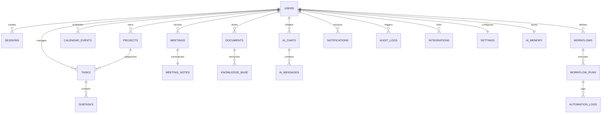
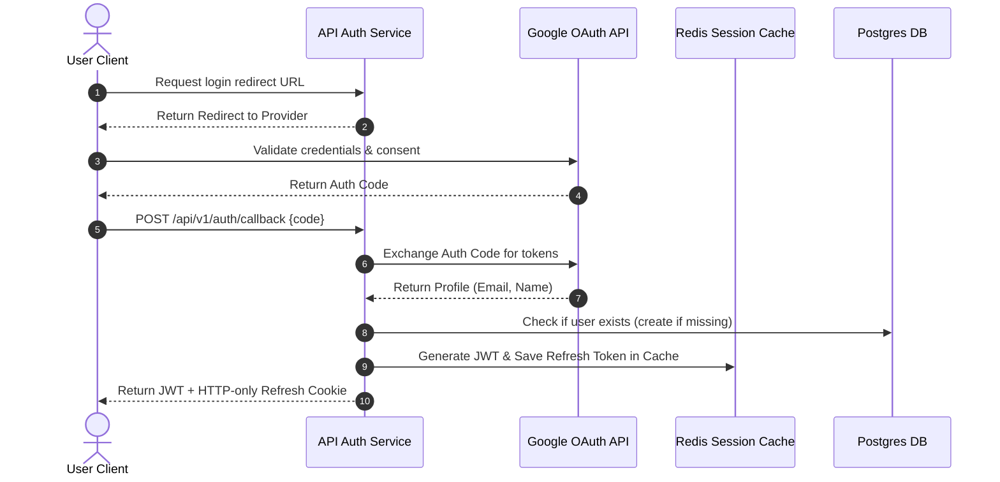
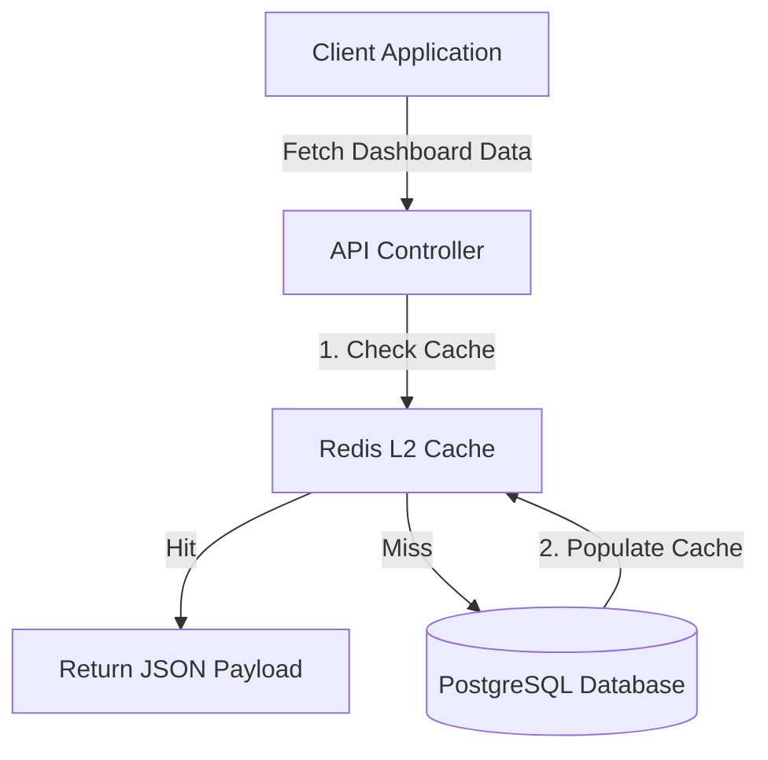

# Backend Foundation & Database Design Document
## NeuroFlow AI: Your Autonomous AI Productivity Operating System

---

## 1. Database Schema & Tables

NeuroFlow AI uses PostgreSQL as its primary relational store. The schema is designed for multi-tenant isolation, quick relational query retrieval, and integration with vector extensions (`pgvector`).

### 1.1 Complete Schema Map (Tables & Fields)

#### Users & Authentication
*   **users**: Core account details.
    *   `id` (UUID, Primary Key)
    *   `email` (VARCHAR, Unique, Indexed)
    *   `password_hash` (VARCHAR, Nullable for OAuth users)
    *   `first_name` (VARCHAR)
    *   `last_name` (VARCHAR)
    *   `avatar_url` (VARCHAR)
    *   `created_at` (TIMESTAMP)
    *   `updated_at` (TIMESTAMP)
    *   `deleted_at` (TIMESTAMP, Nullable for soft deletes)
*   **sessions**: Active user sessions.
    *   `id` (UUID, Primary Key)
    *   `user_id` (UUID, Foreign Key referencing `users.id`)
    *   `refresh_token_hash` (VARCHAR)
    *   `user_agent` (VARCHAR)
    *   `ip_address` (VARCHAR)
    *   `is_blocked` (BOOLEAN)
    *   `expires_at` (TIMESTAMP)
    *   `created_at` (TIMESTAMP)
*   **roles**: User access roles (e.g., Admin, Member, Guest).
    *   `id` (UUID, Primary Key)
    *   `name` (VARCHAR, Unique)
    *   `description` (TEXT)
    *   `created_at` (TIMESTAMP)
*   **permissions**: Action boundaries.
    *   `id` (UUID, Primary Key)
    *   `key` (VARCHAR, Unique, e.g., `task:create`)
    *   `description` (TEXT)
*   **role_permissions**: Many-to-many relationship mapping roles to permissions.
    *   `role_id` (UUID, Foreign Key)
    *   `permission_id` (UUID, Foreign Key)
    *   *Primary Key: (`role_id`, `permission_id`)*

#### Workspace & Tasks
*   **projects**: Workspace groups containing tasks.
    *   `id` (UUID, Primary Key)
    *   `user_id` (UUID, Foreign Key referencing `users.id`)
    *   `name` (VARCHAR)
    *   `description` (TEXT)
    *   `color` (VARCHAR)
    *   `created_at` (TIMESTAMP)
    *   `updated_at` (TIMESTAMP)
*   **tasks**: Core task items.
    *   `id` (UUID, Primary Key)
    *   `project_id` (UUID, Foreign Key referencing `projects.id`, Nullable)
    *   `user_id` (UUID, Foreign Key referencing `users.id`)
    *   `title` (VARCHAR)
    *   `description` (TEXT)
    *   `priority` (ENUM: LOW, MEDIUM, HIGH, URGENT)
    *   `status` (ENUM: BACKLOG, TODO, IN_PROGRESS, COMPLETED)
    *   `due_date` (TIMESTAMP)
    *   `scheduled_start` (TIMESTAMP)
    *   `scheduled_end` (TIMESTAMP)
    *   `created_at` (TIMESTAMP)
    *   `updated_at` (TIMESTAMP)
    *   `deleted_at` (TIMESTAMP, Nullable)
*   **subtasks**: Child items belonging to tasks.
    *   `id` (UUID, Primary Key)
    *   `task_id` (UUID, Foreign Key referencing `tasks.id`)
    *   `title` (VARCHAR)
    *   `is_completed` (BOOLEAN)
    *   `created_at` (TIMESTAMP)

#### Calendars & Meetings
*   **calendar_events**: Integrated schedule blocks.
    *   `id` (UUID, Primary Key)
    *   `user_id` (UUID, Foreign Key referencing `users.id`)
    *   `external_event_id` (VARCHAR, Nullable for external sync)
    *   `title` (VARCHAR)
    *   `description` (TEXT)
    *   `start_time` (TIMESTAMP)
    *   `end_time` (TIMESTAMP)
    *   `is_focus_block` (BOOLEAN)
    *   `created_at` (TIMESTAMP)
*   **meetings**: Structural logs of sync sessions.
    *   `id` (UUID, Primary Key)
    *   `user_id` (UUID, Foreign Key referencing `users.id`)
    *   `title` (VARCHAR)
    *   `audio_url` (VARCHAR, Nullable)
    *   `duration_seconds` (INTEGER)
    *   `created_at` (TIMESTAMP)
*   **meeting_notes**: AI-synthesized summaries of meetings.
    *   `id` (UUID, Primary Key)
    *   `meeting_id` (UUID, Foreign Key referencing `meetings.id`)
    *   `transcript` (TEXT)
    *   `summary` (TEXT)
    *   `action_items_json` (JSONB)
    *   `created_at` (TIMESTAMP)

#### Knowledge & Documents
*   **documents**: Workspace notes and reference uploads.
    *   `id` (UUID, Primary Key)
    *   `user_id` (UUID, Foreign Key referencing `users.id`)
    *   `title` (VARCHAR)
    *   `content` (TEXT)
    *   `created_at` (TIMESTAMP)
    *   `updated_at` (TIMESTAMP)
*   **knowledge_base**: Semantic search metadata logs.
    *   `id` (UUID, Primary Key)
    *   `document_id` (UUID, Foreign Key referencing `documents.id`)
    *   `chunk_content` (TEXT)
    *   `embedding` (vector(1536)) # pgvector embedding column
    *   `created_at` (TIMESTAMP)

#### AI Services & Workflows
*   **ai_chats**: Chat thread contexts.
    *   `id` (UUID, Primary Key)
    *   `user_id` (UUID, Foreign Key referencing `users.id`)
    *   `title` (VARCHAR)
    *   `created_at` (TIMESTAMP)
*   **ai_messages**: Individual chat logs.
    *   `id` (UUID, Primary Key)
    *   `chat_id` (UUID, Foreign Key referencing `ai_chats.id`)
    *   `role` (ENUM: SYSTEM, USER, ASSISTANT)
    *   `content` (TEXT)
    *   `created_at` (TIMESTAMP)
*   **ai_memory**: Persistent user preference stores.
    *   `id` (UUID, Primary Key)
    *   `user_id` (UUID, Foreign Key referencing `users.id`, Unique)
    *   `preferences_json` (JSONB)
    *   `updated_at` (TIMESTAMP)
*   **workflows**: User-defined automation rules.
    *   `id` (UUID, Primary Key)
    *   `user_id` (UUID, Foreign Key referencing `users.id`)
    *   `name` (VARCHAR)
    *   `trigger_type` (VARCHAR)
    *   `steps_json` (JSONB)
    *   `is_active` (BOOLEAN)
    *   `created_at` (TIMESTAMP)
*   **workflow_runs**: Execution tracking tables.
    *   `id` (UUID, Primary Key)
    *   `workflow_id` (UUID, Foreign Key referencing `workflows.id`)
    *   `status` (ENUM: SUCCESS, RUNNING, FAILED)
    *   `started_at` (TIMESTAMP)
    *   `completed_at` (TIMESTAMP, Nullable)
*   **automation_logs**: Granular workflow step outputs.
    *   `id` (UUID, Primary Key)
    *   `run_id` (UUID, Foreign Key referencing `workflow_runs.id`)
    *   `step_name` (VARCHAR)
    *   `status` (ENUM: SUCCESS, FAILED)
    *   `message` (TEXT)
    *   `created_at` (TIMESTAMP)

#### System Utilities
*   **notifications**: Workspace action alert queues.
    *   `id` (UUID, Primary Key)
    *   `user_id` (UUID, Foreign Key referencing `users.id`)
    *   `title` (VARCHAR)
    *   `message` (TEXT)
    *   `is_read` (BOOLEAN)
    *   `created_at` (TIMESTAMP)
*   **analytics**: Granular performance history data.
    *   `id` (UUID, Primary Key)
    *   `user_id` (UUID, Foreign Key referencing `users.id`)
    *   `focus_seconds` (INTEGER)
    *   `tasks_completed` (INTEGER)
    *   `productivity_score` (INTEGER)
    *   `recorded_date` (DATE)
*   **audit_logs**: Security action tracing logs.
    *   `id` (UUID, Primary Key)
    *   `user_id` (UUID, Foreign Key referencing `users.id`)
    *   `action` (VARCHAR)
    *   `ip_address` (VARCHAR)
    *   `payload_json` (JSONB)
    *   `created_at` (TIMESTAMP)
*   **settings**: Configuration variables.
    *   `id` (UUID, Primary Key)
    *   `user_id` (UUID, Foreign Key referencing `users.id`, Unique)
    *   `theme` (VARCHAR)
    *   `focus_mode_sound` (VARCHAR)
    *   `notifications_enabled` (BOOLEAN)
    *   `updated_at` (TIMESTAMP)
*   **attachments**: Core file metadata index.
    *   `id` (UUID, Primary Key)
    *   `user_id` (UUID, Foreign Key referencing `users.id`)
    *   `file_name` (VARCHAR)
    *   `file_url` (VARCHAR)
    *   `file_type` (VARCHAR)
    *   `file_size_bytes` (INTEGER)
    *   `created_at` (TIMESTAMP)
*   **integrations**: Associated third-party credentials.
    *   `id` (UUID, Primary Key)
    *   `user_id` (UUID, Foreign Key referencing `users.id`)
    *   `provider_name` (VARCHAR) # e.g., "GOOGLE_CALENDAR"
    *   `access_token_encrypted` (VARCHAR)
    *   `refresh_token_encrypted` (VARCHAR)
    *   `created_at` (TIMESTAMP)

---

## 2. Entity Relationship Diagram (ERD)

The diagram below maps the relationships between the database tables:



---

## 3. Prisma Schema Design

This production-ready Prisma schema models the database and automates PostgreSQL migration runs:

```prisma
datasource db {
  provider = "postgresql"
  url      = env("DATABASE_URL")
}

generator client {
  provider = "prisma-client-js"
}

enum Priority {
  LOW
  MEDIUM
  HIGH
  URGENT
}

enum TaskStatus {
  BACKLOG
  TODO
  IN_PROGRESS
  COMPLETED
}

enum ChatRole {
  SYSTEM
  USER
  ASSISTANT
}

enum RunStatus {
  SUCCESS
  RUNNING
  FAILED
}

model User {
  id           String           @id @default(uuid()) @db.Uuid
  email        String           @unique
  passwordHash String?
  firstName    String
  lastName     String
  avatarUrl    String?
  createdAt    DateTime         @default(now())
  updatedAt    DateTime         @updatedAt
  deletedAt    DateTime?
  sessions     Session[]
  projects     Project[]
  tasks        Task[]
  events       CalendarEvent[]
  meetings     Meeting[]
  documents    Document[]
  chats        AIChat[]
  memory       AIMemory?
  workflows    Workflow[]
  notifications Notification[]
  auditLogs    AuditLog[]
  settings     Settings?
  attachments  Attachment[]
  integrations Integration[]

  @@index([email])
}

model Session {
  id               String   @id @default(uuid()) @db.Uuid
  userId           String   @db.Uuid
  user             User     @relation(fields: [userId], references: [id], onDelete: Cascade)
  refreshTokenHash String
  userAgent        String
  ipAddress        String
  isBlocked        Boolean  @default(false)
  expiresAt        DateTime
  createdAt        DateTime @default(now())

  @@index([userId])
}

model Project {
  id          String   @id @default(uuid()) @db.Uuid
  userId      String   @db.Uuid
  user        User     @relation(fields: [userId], references: [id], onDelete: Cascade)
  name        String
  description String?
  color       String
  createdAt   DateTime @default(now())
  updatedAt   DateTime @updatedAt
  tasks       Task[]

  @@index([userId])
}

model Task {
  id             String     @id @default(uuid()) @db.Uuid
  projectId      String?    @db.Uuid
  project        Project?   @relation(fields: [projectId], references: [id], onDelete: SetNull)
  userId         String     @db.Uuid
  user           User       @relation(fields: [userId], references: [id], onDelete: Cascade)
  title          String
  description    String?
  priority       Priority   @default(MEDIUM)
  status         TaskStatus @default(TODO)
  dueDate        DateTime?
  scheduledStart DateTime?
  scheduledEnd   DateTime?
  createdAt      DateTime   @default(now())
  updatedAt      DateTime   @updatedAt
  deletedAt      DateTime?
  subtasks       Subtask[]

  @@index([userId, status])
  @@index([dueDate])
}

model Subtask {
  id          String   @id @default(uuid()) @db.Uuid
  taskId      String   @db.Uuid
  task        Task     @relation(fields: [taskId], references: [id], onDelete: Cascade)
  title       String
  isCompleted Boolean  @default(false)
  createdAt   DateTime @default(now())

  @@index([taskId])
}

model CalendarEvent {
  id              String   @id @default(uuid()) @db.Uuid
  userId          String   @db.Uuid
  user            User     @relation(fields: [userId], references: [id], onDelete: Cascade)
  externalEventId String?
  title           String
  description     String?
  startTime       DateTime
  endTime         DateTime
  isFocusBlock    Boolean  @default(false)
  createdAt       DateTime @default(now())

  @@index([userId, startTime])
}

model Meeting {
  id              String       @id @default(uuid()) @db.Uuid
  userId          String       @db.Uuid
  user            User         @relation(fields: [userId], references: [id], onDelete: Cascade)
  title           String
  audioUrl        String?
  durationSeconds Int
  createdAt       DateTime     @default(now())
  notes           MeetingNotes?

  @@index([userId])
}

model MeetingNotes {
  id               String   @id @default(uuid()) @db.Uuid
  meetingId        String   @unique @db.Uuid
  meeting          Meeting  @relation(fields: [meetingId], references: [id], onDelete: Cascade)
  transcript       String
  summary          String
  actionItemsJson  Json
  createdAt        DateTime @default(now())
}

model Document {
  id          String          @id @default(uuid()) @db.Uuid
  userId      String          @db.Uuid
  user        User            @relation(fields: [userId], references: [id], onDelete: Cascade)
  title       String
  content     String
  createdAt   DateTime        @default(now())
  updatedAt   DateTime        @updatedAt
  chunks      KnowledgeBase[]

  @@index([userId])
}

model KnowledgeBase {
  id         String   @id @default(uuid()) @db.Uuid
  documentId String   @db.Uuid
  document   Document @relation(fields: [documentId], references: [id], onDelete: Cascade)
  chunkContent String
  // embedding column skipped as Prisma requires native SQL queries to interface pgvector columns

  @@index([documentId])
}

model AIChat {
  id        String       @id @default(uuid()) @db.Uuid
  userId    String       @db.Uuid
  user      User         @relation(fields: [userId], references: [id], onDelete: Cascade)
  title     String
  createdAt DateTime     @default(now())
  messages  AIMessage[]

  @@index([userId])
}

model AIMessage {
  id        String   @id @default(uuid()) @db.Uuid
  chatId    String   @db.Uuid
  chat      AIChat   @relation(fields: [chatId], references: [id], onDelete: Cascade)
  role      ChatRole
  content   String
  createdAt DateTime @default(now())

  @@index([chatId])
}

model AIMemory {
  id              String   @id @default(uuid()) @db.Uuid
  userId          String   @unique @db.Uuid
  user            User     @relation(fields: [userId], references: [id], onDelete: Cascade)
  preferencesJson Json
  updatedAt       DateTime @updatedAt
}

model Workflow {
  id          String        @id @default(uuid()) @db.Uuid
  userId      String        @db.Uuid
  user        User          @relation(fields: [userId], references: [id], onDelete: Cascade)
  name        String
  triggerType String
  stepsJson   Json
  isActive    Boolean       @default(true)
  createdAt   DateTime      @default(now())
  runs        WorkflowRun[]

  @@index([userId])
}

model WorkflowRun {
  id          String          @id @default(uuid()) @db.Uuid
  workflowId  String          @db.Uuid
  workflow    Workflow        @relation(fields: [workflowId], references: [id], onDelete: Cascade)
  status      RunStatus       @default(RUNNING)
  startedAt   DateTime        @default(now())
  completedAt DateTime?
  logs        AutomationLog[]

  @@index([workflowId])
}

model AutomationLog {
  id        String    @id @default(uuid()) @db.Uuid
  runId     String    @db.Uuid
  run       WorkflowRun @relation(fields: [runId], references: [id], onDelete: Cascade)
  stepName  String
  status    RunStatus
  message   String
  createdAt DateTime  @default(now())
}

model Notification {
  id        String   @id @default(uuid()) @db.Uuid
  userId    String   @db.Uuid
  user      User     @relation(fields: [userId], references: [id], onDelete: Cascade)
  title     String
  message   String
  isRead    Boolean  @default(false)
  createdAt DateTime @default(now())

  @@index([userId, isRead])
}

model AuditLog {
  id          String   @id @default(uuid()) @db.Uuid
  userId      String   @db.Uuid
  user        User     @relation(fields: [userId], references: [id], onDelete: Cascade)
  action      String
  ipAddress   String
  payloadJson Json
  createdAt   DateTime @default(now())

  @@index([userId])
}

model Settings {
  id                   String   @id @default(uuid()) @db.Uuid
  userId               String   @unique @db.Uuid
  user                 User     @relation(fields: [userId], references: [id], onDelete: Cascade)
  theme                String   @default("dark")
  focusModeSound       String   @default("ambient")
  notificationsEnabled Boolean  @default(true)
  updatedAt            DateTime @updatedAt
}

model Attachment {
  id            String   @id @default(uuid()) @db.Uuid
  userId        String   @db.Uuid
  user          User     @relation(fields: [userId], references: [id], onDelete: Cascade)
  fileName      String
  fileUrl       String
  fileType      String
  fileSizeBytes Int
  createdAt     DateTime @default(now())

  @@index([userId])
}

model Integration {
  id                     String   @id @default(uuid()) @db.Uuid
  userId                 String   @db.Uuid
  user                   User     @relation(fields: [userId], references: [id], onDelete: Cascade)
  providerName           String
  accessTokenEncrypted   String
  refreshTokenEncrypted  String
  createdAt              DateTime @default(now())

  @@index([userId])
}
```

---

## 4. Database Optimization Plan

### 4.1 Indexing Strategy
*   **B-Tree Indexes**: Set up on primary and foreign keys to speed up table joins.
*   **Composite Indexes**:
    *   `idx_tasks_user_status`: `(userId, status)` to query active/completed tasks by user.
    *   `idx_events_user_start`: `(userId, startTime)` to quickly load calendar views.
*   **Vector Index**: Set up HNSW (Hierarchical Navigable Small World) index patterns on `knowledge_base.embedding` columns to keep search latency under 50ms.

---

### 4.2 Query Optimization and Pagination
*   **Relational Query Limits**: Avoid database-level offset paginations because they degrade performance at scale. Instead, use cursor-based pagination (e.g., querying `WHERE id > last_seen_id ORDER BY id ASC LIMIT 50`).
*   **Selective Fields**: Prisma queries must use explicit select clauses to only retrieve required fields, avoiding payload bloating.

---

### 4.3 Soft Deletes & Temporal Versioning
*   **Soft Deletes**: Tables like `users` and `tasks` use `deletedAt` timestamps. Read queries check `deletedAt IS NULL` to filter active rows, while background processes clean up expired records periodically.
*   **Versioning**: Critical database records (like settings and documents) use incrementing `version` integers to prevent write conflicts when multiple devices update files simultaneously.

---

## 5. Authentication Architecture

The system uses a security flow utilizing JWT and Google OAuth:



*   **JWT Payload**: Contains user ID, email, role, and workspace parameters. Verified using symmetric key cryptography (HMAC-SHA256).
*   **Refresh Tokens**: Saved as cryptographically hashed keys in Redis, mapping back to active sessions.
*   **Role-Based Access Control (RBAC)**: Middleware decorators validate request scopes before routing to core controllers:
    ```typescript
    // Example layout syntax showing middleware usage
    @UseGuards(JwtAuthGuard, RolesGuard)
    @Roles('ADMIN')
    @Post('/workspace/settings')
    ```

---

## 6. API Specifications (JSON Interface Models)

### 6.1 Authentication API Set
*   **POST `/api/v1/auth/google`**:
    *   *Input*: `{ "token": "google_identity_credential" }`
    *   *Output*: `{ "accessToken": "eyJhbGciOi...", "expiresIn": 900 }`
    *   *Rate Limit*: 20 requests/min per IP.
*   **POST `/api/v1/auth/refresh`**:
    *   *Input*: Cookie: `refreshToken=uuid`
    *   *Output*: `{ "accessToken": "eyJhbGciOi..." }`
    *   *Rate Limit*: 60 requests/min per IP.

---

### 6.2 Task Management API Set
*   **POST `/api/v1/tasks`**:
    *   *Authentication*: Required (Bearer JWT).
    *   *Input*: `{ "title": "Review Slide Layouts", "priority": "HIGH", "dueDate": "2026-07-20T10:00:00Z" }`
    *   *Output*: `{ "id": "uuid", "title": "Review Slide Layouts", "status": "TODO" }`
    *   *Rate Limit*: 100 requests/min.
*   **GET `/api/v1/tasks`**:
    *   *Input*: Query parameters: `status=TODO&limit=50&cursor=uuid`
    *   *Output*: `{ "data": [...], "nextCursor": "uuid" }`

---

### 6.3 Knowledge Vault API Set
*   **POST `/api/v1/knowledge/upload`**:
    *   *Input*: Multipart file payload (PDF/TXT).
    *   *Output*: `{ "documentId": "uuid", "fileName": "slides.pdf", "status": "indexing" }`
    *   *Rate Limit*: 10 uploads/min per tenant.
*   **GET `/api/v1/knowledge/search`**:
    *   *Input*: Query parameter: `q="Branding Guidelines"`
    *   *Output*: `{ "answer": "The branding guidelines state...", "citations": [{ "docId": "uuid", "page": 4 }] }`

---

## 7. Storage Architecture & Ingestion

*   **Cloudinary Integration**: Stores image assets, profile photos, and document previews.
*   **AWS S3 (Private Bucket)**: Stores meeting recordings, raw transcripts, and uploaded PDFs.
*   **Ingestion Limits**:
    *   PDF/TXT Files: Up to 15MB.
    *   Meeting Audio Streams: Up to 250MB.
*   **Temporary Space**: Local processing directories inside worker containers are formatted as temporary storage areas, which are automatically cleared when processing completes.

---

## 8. Caching Engine



*   **Session Cache**: Refresh tokens and security blocklists are stored in Redis (TTL: 7 days) to speed up authentication checks.
*   **AI Cache**: Common AI completions and prompt contexts are cached in Redis to reduce API costs.
*   **Notification Cache**: Unread alerts are cached as key-value entries to avoid hit counts on database queries.

---

## 9. Search Architecture (Hybrid Retrieval)

NeuroFlow AI uses a hybrid search system to ensure high-accuracy document retrieval.

```
       +--------------------------------------------------------+
       |             HYBRID SEARCH RETRIEVAL                    |
       +---------------------------+----------------------------+
       |   Vector Search           |   Keyword Search           |
       |   - pgvector / Qdrant     |   - PostgreSQL Full Text   |
       |   - Cosine similarity     |   - Lexical indexing       |
       +---------------------------+----------------------------+
                                 |
                                 v
                       +--------------------+
                       |  Reciprocal Rank   |
                       |  Fusion (RRF)      |
                       +---------+----------+
                                 |
                                 v
                       +--------------------+
                       |  Top Results Rerank|
                       +--------------------+
```

1.  **Semantic Retrieval**: Query strings are embedded into vectors using text embedding models and matched in PostgreSQL using `pgvector` Cosine Similarity (`<=>`).
2.  **Lexical Retrieval**: The query runs against standard PostgreSQL full-text search indexes (`tsvector`) to locate exact matches.
3.  **Reciprocal Rank Fusion (RRF)**: Synthesizes both search tracks to surface the most relevant context blocks for the LLM prompt.

---

## 10. Error Handling & Retry Strategies

*   **Validation Errors**: The API Gateway uses schemas to validate request payloads before they reach business services. If validation fails, it returns a `400 Bad Request` with structured error codes.
*   **Retry Mechanisms**: Failed writes or API calls to external services (like Google Calendar or Slack) trigger an exponential backoff retry loop:
    $$\text{Delay} = \text{Base} \times 2^{\text{retry\_count}} + \text{jitter}$$
*   **Dead Letter Queue (DLQ)**: If a job fails after 5 retries, it is moved to a DLQ for manual inspection and debugging.

---

## 11. Security Foundations

*   **API Security**: Uses CORS policies to only allow traffic from verified web domains, and implements helmet headers to prevent cross-site scripting (XSS) attacks.
*   **Encryption**: Integrated API credentials (like Google OAuth tokens) are encrypted before being written to PostgreSQL using AES-256-GCM, with secret keys managed by cloud Key Management Services (KMS).
*   **Audit Logging**: Critical events (like login changes, workspace exports, or permissions updates) write immutable records to the audit log database.

---

## 12. Backend Folder Structure

Below is the workspace backend folder structure:

```
backend/
├── src/
│   ├── config/                     # Environment configurations & database scripts
│   ├── common/                     # Shared middleware, guards, and decorators
│   ├── modules/
│   │   ├── auth/                   # Controller, service, and strategy files
│   │   ├── tasks/                  # Task, sub-task, and status services
│   │   ├── calendar/               # External calendar integrations
│   │   ├── knowledge/              # pgvector, upload, and RAG services
│   │   └── workflows/              # Automation engine files
│   ├── prisma/
│   │   ├── schema.prisma           # Prisma database schema definition
│   │   └── migrations/             # Generated database migration files
│   └── app.ts                      # App initialization scripts
├── package.json
└── tsconfig.json
```

---

## 13. System Review

### 13.1 Database Performance Bottlenecks
*   *Concern*: Under heavy calendar load, frequently updating task arrays can lock rows in PostgreSQL.
*   *Solution*: Subtasks are stored in a separate table, allowing users to update checkboxes without locking parent rows.

### 13.2 Memory Scaling Considerations
*   *Concern*: Large context histories can overflow LLM limits and increase API usage costs.
*   *Solution*: The RAG pipeline chunks and retrieves only the most relevant document blocks, while chat threads use summarization limits to prune long histories.

---
*Document prepared by the NeuroFlow AI Backend Architecture Team.*
*Confidential - For Internal Hackathon Evaluation Only.*
