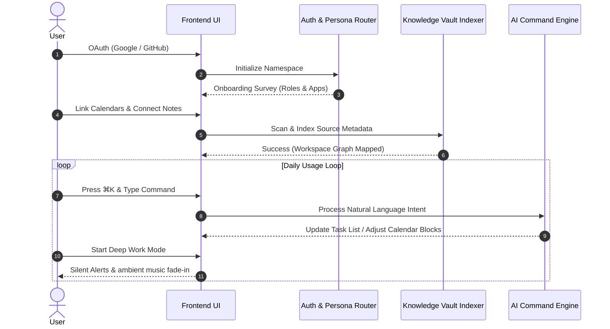
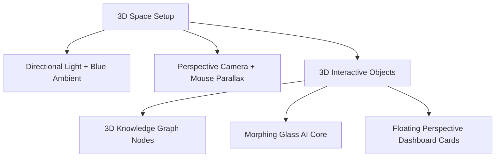

# NeuroFlow AI: Design Documentation (Phase 1)
## Your Autonomous AI Productivity Operating System

---

## 1. Information Architecture

### 1.1 Sitemap and Application Hierarchy

NeuroFlow AI is architected as an **omni-present interface**. Instead of navigating between traditional pages, the user operates inside a spatial workspace. The interface hierarchy consists of:
*   **The Hub (Layer 0)**: The ambient canvas displaying focus state, schedules, and active tasks.
*   **The Command Orbit (Layer 1)**: The global keyboard-triggered overlay (Raycast-style) that controls actions, searches, and workflows.
*   **The Focus Panes (Layer 2)**: Deep-dive sheets that slide in from the right viewport boundary to show context, detailed notes, or analytics without breaking the parent view.

```mermaid
graph TD
    %% Base Workspace Architecture
    Hub[Layer 0: Spatial Canvas Hub]
    Command[Layer 1: Command Orbit Bar]
    Panes[Layer 2: Focus Detail Sheets]

    Hub --> Dashboard[Focus Dashboard]
    Hub --> Planner[Visual Calendar Timeline]
    Hub --> Board[Kanban Task Manager]
    Hub --> Vault[Knowledge Vault Node Graph]

    Command --> Search[Omni-Search Query]
    Command --> Action[Workflow Automator Builder]
    Command --> CommandMeeting[Meeting Copilot Toggle]

    Panes --> NotesSheet[Document Canvas Editor]
    Panes --> AnalyticsSheet[Insight Coaching Center]
    Panes --> SettingSheet[Security & Integrations Manager]
    
    style Hub fill:#1e1e2f,stroke:#6c5ce7,stroke-width:2px;
    style Command fill:#111,stroke:#a8a5e6,stroke-width:2px;
    style Panes fill:#0c0c14,stroke:#00d2d3,stroke-width:1px;
```



---

### 1.2 Navigation Hierarchy and Layout Flow

```
+---------------------------------------------------------------------------------------------------+
|  [F] Focus Mode Status Bar                    [Search Center: ⌘K]                 [Coaching Score] |
+---+-----------------------------------------------------------------------------------------------+
| S |                                                                                               |
| I |                                   MAIN VISUAL CANVAS                                          |
| D |                                                                                               |
| E |                           (Switches dynamically based on view)                                 |
| B |                                                                                               |
| A |                   - Focus Board / Adaptive Calendar / Knowledge Graph                         |
| R |                                                                                               |
|   |                                                                                               |
+---+-----------------------------------------------------------------------------------------------+
| [Core Orb] AI Ambient Indicator                                          [Quick Copilot: ⌘M]       |
+---------------------------------------------------------------------------------------------------+
```

#### Primary Navigation (Sidebar)
*   **Focus Dashboard (Default)**: Visual energy tracker, task focus, calendar view.
*   **Adaptive Planner**: Unified drag-and-drop calendar/task scheduler.
*   **Knowledge Vault**: Visual network node graph of docs and references.
*   **Workflow Engine**: Canvas for mapping autonomous task automations.

#### Secondary Navigation (Global Header/Footer HUD)
*   **Command Center Trigger**: Center-top input bar (triggerable via `⌘K`).
*   **Mascot Core Orb**: Interactive AI state indicator (AI processing state, focus reminder).
*   **Notifications Tray**: Sliding panel containing scheduled actions and alerts.
*   **Workspace Switcher**: Top-left dropdown for project context toggles.

---

### 1.3 User Permissions and Security Boundaries

*   **Owner (Workspace Admin)**: Complete control over payment details, system integrations, data deletion settings, and user invites.
*   **Member (Full Access)**: Can write documents, edit tasks, execute custom workflows, and invite guest collaborators.
*   **External Guest (Restricted Access)**: Can edit specified project notes, tasks, or calendars, but cannot view overall workspace folders.

---

### 1.4 Navigation Logic and Shortcut Mapping

NeuroFlow AI uses a keyboard-first navigation system. The application context updates dynamically to match current focus states.

| Shortcut | Action Context | Expected UI Event |
| :--- | :--- | :--- |
| `⌘K` / `⌘P` | Global | Opens the AI Command Center overlay. |
| `⌘M` | Global | Toggles the Meeting Copilot recorder interface. |
| `⌘D` | Global | Routes back to the main Focus Dashboard. |
| `⌘1` | Global | Switches to Adaptive Planner view. |
| `⌘2` | Global | Switches to Kanban Task Manager view. |
| `⌘3` | Global | Switches to Knowledge Vault Network Graph. |
| `⌘4` | Global | Switches to Workflow Automation Canvas. |
| `⌘I` | Global | Opens the AI Productivity Insights sheet. |
| `Esc` | Modal/Pane | Closes current overlay, pane, or dialog. |
| `Tab` | Command Bar | Cycles through available AI prompt suggestions. |

---

## 2. User Flows

### 2.1 Complete Workspace Lifecycle

The user path shifts from a clean signup directly into onboarding and active productivity blocks.



---

### 2.2 Core Interaction Flows

#### Onboarding Happy Path
1. **OAuth Sign-in**: Quick login using credentials.
2. **Context Setup**: User selects their focus role (e.g., Designer, Developer, Founder) and links workspace tools.
3. **Knowledge Initialization**: The system scans connected files to build a private knowledge graph index.
4. **Interactive Walkthrough**: The Command Center invites the user to run their first prompt (e.g., *"Schedule research blocks for my projects next week"*).

#### Onboarding Edge Case: Large Mail/Doc Sync Delay
* **Problem**: Scanning connected workspace accounts takes longer than 2 minutes due to file count.
* **UX Strategy**: Rather than showing loading spinners, the dashboard opens with interactive guides while a progress indicator shows the status in the sidebar.
* **Notification**: A subtle toast alert pops up when indexing completes: *"Knowledge graph fully mapped. Open ⌘K to query your database."*

---

## 3. Feature Flows

### 3.1 AI Command Center
* **Purpose**: Single, central prompt interface to query notes, create tasks, and build workflows.
* **User Interaction**:
  1. User presses `⌘K`. A glassmorphic text box appears in the center of the viewport.
  2. User inputs a task: *"Summarize my last meeting with Elena and add the next steps to my task list."*
* **AI Processing**:
  1. The system identifies two tasks: retrieving the meeting details and creating a task card.
  2. Queries the Knowledge Vault for transcripts matching "meeting with Elena."
  3. Extracts action items from the text.
  4. Generates task objects with dates.
* **Expected Result**: The interface displays:
  * A concise meeting summary.
  * Preview cards for two new tasks (e.g., *"Design logo update"* and *"Send pitch email"*).
* **Error State**: No recent meeting matching "Elena" is found in the database.
* **Recovery Flow**: The system prints a message: *"Could not locate a meeting with Elena in the past 7 days. Would you like to search your emails instead?"* and displays a list of suggested contacts.

---

### 3.2 Autonomous Planner & OODA Scheduler
* **Purpose**: Automatically balance task schedules on calendars based on cognitive load metrics.
* **User Interaction**:
  1. User drags a new task card onto their calendar grid.
  2. Toggles "Auto-Schedule."
* **AI Processing**:
  1. The scheduler reviews meeting buffers and task priority levels.
  2. Evaluates the user's historical energy peaks to reserve deep-work periods.
  3. Moves lower-priority meetings to open calendar slots.
* **Expected Result**: The calendar automatically updates, displaying structured blocks for deep-work focus periods.
* **Error State**: The calendar has no remaining free blocks to fit new high-priority tasks.
* **Recovery Flow**: The system displays a layout alert: *"Schedule is full. Click to decline conflicting low-priority meetings or add a 30-minute buffer window."*

---

### 3.3 Knowledge Vault (Node Graph Visualizer)
* **Purpose**: Display relationships between files, emails, and tasks as an interactive 3D node graph.
* **User Interaction**:
  1. User clicks the "Knowledge Vault" icon in the sidebar navigation.
  2. Double-clicks a node labeled "Project Launch."
* **AI Processing**:
  1. Fetches semantic connection strengths from the vector index.
  2. Updates relative node coordinates based on relevance to the query.
* **Expected Result**: The viewport transitions into a 3D network view. Nodes pull together or push apart depending on similarity scores.
* **Error State**: The graph returns no connections for a new query.
* **Recovery Flow**: The dashboard displays a prompt: *"No direct files linked to this topic yet. Upload draft notes to start build connections."*

---

## 4. Low Fidelity Wireframes

### 4.1 Global Focus Dashboard Layout

```
======================================================================================
[Logo] NeuroFlow AI    [Today's Vibe: ⚡ Deep Focus Mode]      [Profile Photo]
======================================================================================
|                     |                                                              |
|  [1] FOCUS DASHBOARD |  [⚡ COMMAND HUD]                                            |
|  [2] ADAPTIVE PLAN   |  "What are we building today? Try: 'Organize my week'..."    |
|  [3] KNOWLEDGE GRAPH |                                                              |
|  [4] WORKFLOW CANVAS |  ----------------------------------------------------------  |
|                     |  [📅 TODAY'S CALENDAR BLOCK]      [📋 FOCUS TASK LIST]       |
|  -----------------  |  09:00 - 10:30 Focus Block        [ ] Design Pitch Deck      |
|  [🤖 AI MASCOT ORB]  |  11:00 - 11:30 Standup Sync       [ ] Draft Proposal         |
|  "Ready for task"   |  13:00 - 14:30 Creative Studio    [ ] Review Analytics       |
|                     |  ----------------------------------------------------------  |
|  [⚙️] Settings       |  [💡 PRODUCTIVITY METRICS]        [🎙️ ACTIVE COPILOT STATUS] |
|                     |  Score: 84 | Focus: 4.2h          "No active audio input"    |
======================================================================================
```

---

### 4.2 AI Command Center Overlay (⌘K)

```
       +-------------------------------------------------------------+
       |   [⌘K] Search notes, schedule tasks, build workflows...     |
       +-------------------------------------------------------------+
       |   💡 Suggested Actions:                                     |
       |   - "Schedule deep-work blocks for next week"               |
       |   - "Find all emails from Liam regarding branding"          |
       |   - "Create a new document for marketing ideas"             |
       +-------------------------------------------------------------+
       |   📁 Recent Context:                                        |
       |   📄 logo_drafts_v2.fig (Figma)                             |
       |   📅 Team Standup (Google Calendar)                        |
       +-------------------------------------------------------------+
```

---

### 4.3 Adaptive Planner (Drag-and-Drop View)

```
======================================================================================
[Calendar View]  Month | Week | Day                   [⚡ Auto-Schedule Tasks Mode: ON]
======================================================================================
|   TASKS QUEUE        |   MON 19               |   TUE 20               |   WED 21    |
|   ------------------ |   -------------------- |   -------------------- |   --------- |
|   [ ] Code Review    |   09:00 - 10:30        |   09:00 - 11:00        |   09:00     |
|   [ ] Write API Doc  |   [⚡ Code Review]     |   [⚡ Study Block]     |   [⚡ Focus] |
|   [ ] Update Style   |                        |                        |             |
|                      |   11:00 - 12:00        |   11:00 - 11:30        |   11:00     |
|   [🎨 Design Logo]   |   [👥 Sync Meeting]    |   [👥 Team Sync]       |   [👥 Client|
|   (Ready to Drag)    |                        |                        |             |
======================================================================================
```

---

### 4.4 Knowledge Vault (Spatial Node Graph View)

```
======================================================================================
[Knowledge Vault]  Nodes: 142 | Connections: 398          [🔍 Search Nodes]
======================================================================================
|                                                                                    |
|                           (O) Note: Logo Design                                    |
|                            /       \                                               |
|                           /         \                                              |
|      (O) Client Email -- (O) Project   (O) Figma File                              |
|                           \  Brand      /                                          |
|                            \           /                                           |
|                           (O) Task: Pitch Deck                                     |
|                                                                                    |
|                                                                                    |
|   [Node Details Panel]                                                             |
|   Selected Node: Project Brand | Owner: Elena | Linked Assets: 4                   |
======================================================================================
```

---

## 5. High Fidelity UI Detail

To create a premium SaaS interface (matching the standards of Apple, Stripe, and Linear), we design the screens down to specific layout, grid, and typography configurations.

### 5.1 Grid, Layout, and Spacing Principles
*   **Grid System**: 12-column adaptive layout on desktop (max width: 1440px) with 24px gutters. Focus sheets slide in on 4-column widths (480px).
*   **Spacing System**: 8pt grid scale (8px, 16px, 24px, 32px, 48px, 64px) for layout gutters, padding, and margins.
*   **Border Radius Scale**:
    *   `8px`: Buttons, badge cards, inline inputs.
    *   `16px`: Main dashboard cards, list items, popup dialog panels.
    *   `24px`: Command Center HUD, large visual banners, panel containers.

---

### 5.2 Typographical Styling Hierarchy
*   **Primary Font**: *Outfit* (for display headers, badges, and primary status indicators).
*   **Secondary Font**: *Inter* (highly readable sans-serif for body copy, lists, forms, and descriptions).
*   **Monospace Font**: *Fira Code* (for keyboard shortcuts, code snippets, search logs, and data parameters).

```
[Outfit Bold 32px] ----> MAIN TITLE HEADERS (e.g., Dashboard welcoming, panel topics)
  [Outfit Medium 20px] -> SUB-TITLES (e.g., Section labels, widget titles)
    [Inter Regular 14px] -> BODY COPY (e.g., Task names, descriptions, search outputs)
      [Fira Code 12px] ---> BADGES & SHORTCUTS (e.g., [⌘K], status timestamps)
```

---

### 5.3 Interface State Guidelines

#### Loading States (Adaptive Skeleton UI)
*   Instead of standard loaders, cards use skeleton blocks styled with animated shimmers (duration: 1.5s, linear-gradient at a 90-degree angle from dark grey to light grey).
*   The ambient AI mascot orb pulses softly (opacity shifting from `0.4` to `0.8`) during LLM processing operations.

#### Empty States (Zero Clutter Graphics)
*   Minimal illustration style featuring subtle dark outlines, vector lines, and gradient glows.
*   No standard placeholders. Empty dashboards show a clean search prompt with recommended actions (e.g., *"All tasks closed. Click to schedule next week's focus blocks."*).

#### Validation States (Success, Error, Warnings)
*   **Success**: Green outlines (`#00b894`) accompanied by a subtle confetti micro-animation.
*   **Error**: Red highlights (`#ff7675`) paired with shake animations (amplitude: 8px, duration: 250ms).
*   **Warning**: Yellow outlines (`#ffeaa7`) indicating sync conflicts or rate-limiting warnings.

---

## 6. Design System

This system uses Figma-ready specifications to ensure design and styling consistency across developer environments.

### 6.1 Typography Scale
```json
{
  "fontFamily": {
    "display": "Outfit, sans-serif",
    "sans": "Inter, sans-serif",
    "mono": "Fira Code, monospace"
  },
  "fontSize": {
    "xs": "0.75rem (12px)",
    "sm": "0.875rem (14px)",
    "base": "1rem (16px)",
    "lg": "1.25rem (20px)",
    "xl": "1.5rem (24px)",
    "xxl": "2rem (32px)"
  },
  "fontWeight": {
    "regular": 400,
    "medium": 500,
    "semibold": 600,
    "bold": 700
  }
}
```

---

### 6.2 Color Palette (Light/Dark Mode Tokens)

We employ a dark-mode-first color palette designed for high contrast, minimal eye strain, and premium aesthetics.

```
Neutral Base:
[#030303] Very Dark Grey (App Canvas Background)
[#0C0C0E] Dark Charcoal (Dashboard Panels & Cards)
[#16161A] Medium Grey (Hover States, Borders, Tooltips)
[#A0A0A5] Soft Grey (Secondary Labels, Body Copy)
[#FFFFFF] Pure White (Headers, Focus Content)

Accent Glows:
[#6C5CE7] Royal Violet (Primary Buttons, AI Processing State)
[#00D2D3] Bright Cyan (Active Focus Block, Knowledge Nodes)
[#00B894] Emerald Green (Task Completion Confetti, Success State)
[#FF7675] Coral Red (Error highlights, Critical Deadline warnings)
```

---

### 6.3 Glassmorphism UI Blueprint
To create visual depth, panels use layered transparency rules:

```css
.glass-panel {
  background: rgba(12, 12, 14, 0.75);
  backdrop-filter: blur(20px);
  border: 1px solid rgba(255, 255, 255, 0.08);
  box-shadow: 0 8px 32px 0 rgba(0, 0, 0, 0.4);
}
.glass-panel-hover {
  background: rgba(22, 22, 26, 0.85);
  border: 1px solid rgba(108, 92, 231, 0.25);
  box-shadow: 0 12px 40px 0 rgba(108, 92, 231, 0.15);
}
```

---

### 6.4 Shared Component System

#### Primary Button State
*   **Resting**: Glass background styled with Royal Violet borders (`#6C5CE7`). White text.
*   **Hover**: Background fills with solid Royal Violet (`#6C5CE7`), casting a soft glow shadow (`rgba(108, 92, 231, 0.45)`, blur radius: 12px).
*   **Active**: Scaled down to `0.98` scale to communicate click physics.

#### Text Input Styling
*   **Resting**: Dark grey background (`#0C0C0E`), border colored in soft grey (`#16161A`). Outfit medium text.
*   **Focused**: Border shifts to Bright Cyan (`#00D2D3`), casting a soft blue shadow glow.

---

## 7. Motion Design

Every transition and movement in NeuroFlow AI is animated using natural physics parameters (modeled after Apple's spring logic) to avoid jarring layout shifts.

```
       +-----------------------+
       |   Spring Physics:     |
       |   Stiffness: 180      |
       |   Damping: 24         |  --> Clean, responsive, bounce-free motion
       |   Mass: 1.0           |
       +-----------------------+
```

### 7.1 Motion Parameters and Timing Specs

| Event | Transition Type | Animation Method | Duration | Physics Config (Framer Motion) |
| :--- | :--- | :--- | :--- | :--- |
| **Command Bar Open** | Pop & Fade In | Spring scale from `0.92` -> `1.0` | 200ms | `stiffness: 300, damping: 28` |
| **View Route Switch** | Cross-fade Slide | Slide offset 20px horizontally | 320ms | `stiffness: 180, damping: 24, mass: 1.0` |
| **Kanban Card Drag** | Lift & Tilt | Scale to `1.04` and rotate 2deg | Active | `stiffness: 400, damping: 20` |
| **Task Completion** | Confetti Blast | Scale down task name to `0` | 400ms | `stiffness: 150, damping: 15` |
| **AI Orb Thinking** | Breathing Glow | Scale shifts `1.0` <-> `1.15` | Loop | `ease: "easeInOut", duration: 2s` |
| **Focus Pane Slide** | Slide overlay | Slide in from right edge | 280ms | `stiffness: 220, damping: 25` |

---

### 7.2 Custom Animation Sequences

#### The "Task Completion" Sequence
1. The user clicks a task checkbox.
2. The checkbox icon draws a check mark (`#00b894`) using a stroke-dashoffset animation (duration: 150ms).
3. A cluster of micro-particles (6–8 dots) blasts outwards from the checkbox center, fading out over 200ms.
4. The text of the task is struck through with a horizontal line drawing left-to-right (duration: 180ms), then fades to `0.4` opacity.

#### The "AI Thinking" Sequence
1. The AI core mascot orb transitions from its standard deep cyan color to a shifting violet gradient (`#6C5CE7` to `#00D2D3`).
2. The orb shape deforms slightly using a sine-wave morphing algorithm, creating a liquid droplet appearance.
3. Shimmer lines flow outward from the orb center, corresponding to the real-time token processing rate.

---

## 8. 3D Experience

NeuroFlow AI uses WebGL (via Three.js) to add visual depth to dashboards, organizing content into three-dimensional spaces.



### 8.1 3D Component Specifications

#### The AI Core Orb (Landing Page / HUD Footer)
*   **Scene Description**: A morphing glass sphere built with a custom Vertex Shader.
*   **Visual Physics**: Shifting noise gradients create dynamic surface wave patterns.
*   **Lighting Config**: Features two directional spotlights (Cyan `#00D2D3` and Violet `#6C5CE7`) positioned behind the sphere to generate realistic glass refraction glow highlights.
*   **Mouse Interaction**: The sphere rotates and morphs toward the user's cursor as they move it across the canvas.

#### Interactive 3D Knowledge Network
*   **Scene Description**: Each document, calendar block, and task operates as a physical node in a 3D coordinate space.
*   **Visual Connections**: Shimmering connection threads (intensity corresponding to relevance) bridge related nodes.
*   **Mouse Interaction**: Left-clicking and dragging allows the user to rotate the space, while scroll wheel inputs zoom in and out of specific clusters.

---

## 9. Micro-Interactions

Micro-interactions provide immediate feedback, helping users understand system status without visual clutter.

```
       +--------------------------------------------------------+
       |             MICRO-INTERACTION PHYSICS                  |
       +---------------------------+----------------------------+
       |   Hover Event             |   Click Feedback           |
       |   - Elevate card Z-depth  |   - Scale down to 0.98     |
       |   - Accent outline glow   |   - Particle burst         |
       |   - Blur filter shifts    |   - Haptic vibe trigger    |
       +---------------------------+----------------------------+
```

### 9.1 Interactive Element States

#### Drag-and-Drop Tasks
*   **Trigger**: Clicking and holding a Kanban task card.
*   **Visual Response**: The card lifts slightly off the canvas, its shadow blur radius increases to 24px with `0.3` opacity, and the card tilts 2 degrees to mirror physical movement.
*   **Target Areas**: Available calendar drop zones light up with a dashed cyan border outline, encouraging the user to drop the card in place.

#### Voice Command Center Activation
*   **Trigger**: Pressing and holding the microphone button in the Command Center.
*   **Visual Response**: The button glows violet, and a clean sine wave animation matches the audio input volume.
*   **Processing State**: The wave transitions into a looping circle of dots when the audio ends, indicating that the system is processing the voice commands.

---

## 10. Responsive Design

The spatial dashboard transitions smoothly from large desktop viewports down to mobile screens.

```
Desktop (1440px+)          Tablet (1024px)             Mobile (375px)
+-----------------------+  +-----------------------+  +-----------------------+
| Nav |  Canvas  | Pane |  | Nav |      Canvas     |  |    Canvas (Reflow)    |
|     |          |      |  |     |                 |  |                       |
|     |          |      |  |     |                 |  |                       |
+-----------------------+  +-----------------------+  +-----------------------+
  (3-Column Layout)          (2-Column Layout)          (1-Column Drawer Stack)
```

### 10.1 Layout Adaptation Rules

#### Desktop (1440px and wider)
*   **Layout Style**: 3-column layout. Sidebar navigation is visible, the workspace canvas takes up the center area, and focus detail sheets slide in from the right edge.
*   **Hover states**: Full 3D mouse parallax and card hover highlights are active.

#### Laptop / Large Tablet (1024px to 1439px)
*   **Layout Style**: 2-column layout. Sidebar navigation collapses to an icon bar (64px width) to maximize visual space for the main workspace canvas.
*   **Gutter Spacing**: Gutters scale down to 16px to protect readability.

#### Mobile Viewports (375px to 1023px)
*   **Layout Style**: Single-column layout. Navigation moves to a bottom-dock bar.
*   **Panel Reflow**: The main dashboard cards stack vertically. Detail panels slide up from the bottom as full-screen drawers.
*   **Visual Optimizations**: WebGL 3D graph renders are replaced with clean list views to reduce mobile processor and battery drain.

---

## 11. Accessibility (a11y)

NeuroFlow AI is designed from the ground up to ensure everyone can navigate the workspace comfortably.

### 11.1 Key Accessibility Specifications
*   **Keyboard Navigation**: Every button, input, and task checkbox has clear focus indicators (2px thick dashed Cyan ring `#00D2D3` with a 4px offset). Tab indexes are mapped logically across all screens.
*   **Screen Reader Optimization**: Elements use semantic ARIA tags (e.g., `aria-live="polite"` for command updates, `aria-expanded` for menu toggles).
*   **Reduced Motion**: Respects system-level reduced motion preferences. When enabled, 3D WebGL scenes stop, parallax transforms disable, and spring slide animations are replaced with simple, clean opacity fades.
*   **Contrast Ratios**: Body text meets a minimum contrast ratio of **4.5:1** against backgrounds, while headers achieve a contrast ratio of **7:1** (`#FFFFFF` on `#030303`).

---

## 12. Visual Branding

Our branding balances minimalist workspace design with clean, organic accents.

```
       +--------------------------------------------------------+
       |                     BRAND SHIELD                       |
       +--------------------------------------------------------+
       |   Logo Concept: The Infinity Flow Circle               |
       |   - Clean geometric loop                               |
       |   - Linear gradient color scheme                       |
       |   - Shifting violet-cyan core                          |
       +--------------------------------------------------------+
```

### 12.1 Brand Architecture Elements
*   **Logo Concept**: A clean infinity loop representing continuous workflow integration. The left side is a solid dark grey line, while the right features a gradient that shifts from Violet `#6C5CE7` to Cyan `#00D2D3`.
*   **The Mascot Core**: An organic glass orb that morphs, pulses, and glows to reflect the system's current AI processing state.
*   **Illustration Style**: Thin vector line art combined with glowing gradient backgrounds, evoking a clean, high-tech aesthetic.
*   **Icon Language**: Lightweight, geometric custom icons (24x24px scale, 1.5px stroke weight) that maintain consistency across all modules.

---

## 13. Landing Page

The landing page must immediately communicate that NeuroFlow AI is an interactive Operating System rather than another traditional to-do application.

### 13.1 Landing Page Blueprint

```
+---------------------------------------------------------------------------------------+
|  [Logo] NeuroFlow AI           Features    Integrations    Pricing    [Get Started]   |
+---------------------------------------------------------------------------------------+
|                                                                                       |
|                               YOUR AUTONOMOUS AI                                      |
|                             PRODUCTIVITY OPERATING SYSTEM                             |
|                                                                                       |
|                   Organize your work, automate your schedule,                         |
|                      and focus on what matters.                                       |
|                                                                                       |
|                   [Start Free Trial]     [Watch Demo ⚡]                              |
|                                                                                       |
|                                                                                       |
|                        [INTERACTIVE 3D HERO WORKSPACE DEMO]                           |
|                      (Shows real-time task creation and graph)                        |
|                                                                                       |
+---------------------------------------------------------------------------------------+
|                                                                                       |
|  [⚡ FEATURE MODULES GRID]                                                             |
|  +--------------------------+  +--------------------------+  +---------------------+  |
|  | AI Planner               |  | Knowledge Vault          |  | Meeting Copilot     |  |
|  | - Autonomous scheduling  |  | - Spatial graph search   |  | - Live transcription|  |
|  +--------------------------+  +--------------------------+  +---------------------+  |
|                                                                                       |
+---------------------------------------------------------------------------------------+
|                                                                                       |
|  [💳 TRANSPARENT PRICING]                                                             |
|  Free Tier ($0)              Pro Plan ($12/mo)            Team Workspace ($25/user/mo)|
|                                                                                       |
+---------------------------------------------------------------------------------------+
|  © 2026 NeuroFlow AI. All rights reserved.                      Privacy    Terms      |
+---------------------------------------------------------------------------------------+
```

*   **Hero Interactive Demo**: Visitors can input prompts directly into a mockup Command Center (e.g., *"Show me how you organize my day"*). The page dynamically updates an interactive dashboard layout below the input bar, demonstrating the value of the platform immediately.

---

## 14. Dashboard Experience

The Focus Dashboard consolidates tasks, schedules, and analytics into a single interactive layout.

```
======================================================================================
[🚀 Focus Mode: ON]       Today's Goal: Core Concept Pitch Deck       [Time: 10:14 AM]
======================================================================================
|                                                                                    |
|  [⏰ ADAPTIVE FOCUS BLOCK]                           [📊 PRODUCTIVITY INSIGHTS]    |
|  Task: Design Slide Layout                           - Focus Score: 87/100         |
|  Time Remaining: 42 mins                             - Deep Work Target: 3.5h      |
|  (Ambient soundscapes active)                        - Completed tasks: 4          |
|                                                                                    |
|  --------------------------------------------------  ----------------------------  |
|                                                                                    |
|  [📋 TOP TASK PRIORITY]                              [📅 UPCOMING TIMELINE]        |
|  [ ] Review layout style guides                      11:30 - Team Standup Sync     |
|  [ ] Export assets to Figma                          13:00 - Client Pitch Call     |
|                                                                                    |
|  --------------------------------------------------  ----------------------------  |
|                                                                                    |
|  [🎙️ MEETING RECORDER WIDGET]                         [🤖 MASCOT ORB PREVIEW]       |
|  - Standup Sync starting in 15 mins                  "Preparing focus assets..."   |
|                                                                                    |
======================================================================================
```

---

## 15. Design Tokens

Design tokens are exported as structured JSON datasets to ensure consistency across style sheet layers.

```json
{
  "color": {
    "neutral": {
      "black": "#030303",
      "panel": "#0C0C0E",
      "border": "#16161A",
      "text": "#A0A0A5",
      "white": "#FFFFFF"
    },
    "accent": {
      "violet": "#6C5CE7",
      "cyan": "#00D2D3",
      "green": "#00B894",
      "red": "#FF7675"
    }
  },
  "spacing": {
    "base": "8px",
    "md": "16px",
    "lg": "24px",
    "xl": "32px",
    "xxl": "48px"
  },
  "radius": {
    "sm": "8px",
    "md": "16px",
    "lg": "24px"
  },
  "shadow": {
    "soft": "0 8px 32px 0 rgba(0, 0, 0, 0.4)",
    "glow": "0 0 16px 0 rgba(108, 92, 231, 0.35)",
    "active": "0 12px 40px 0 rgba(108, 92, 231, 0.15)"
  },
  "zindex": {
    "canvas": 1,
    "panel": 10,
    "overlay": 50,
    "hud": 100
  }
}
```

---

## 16. Design Review

### 16.1 Design Review & Competitive Advantage Matrix

| Design Parameter | NeuroFlow AI | Notion | Linear | Motion / Google Calendar |
| :--- | :--- | :--- | :--- | :--- |
| **Interface Context** | Single Spatial Canvas (Zero Context-Switching). | Document list tree (Requires nesting). | List & Board databases. | Split Calendar grid & Task logs. |
| **Command Input** | Natural Language Processing (Command Bar). | Slash commands (`/page`, `/heading`). | Command menu (Action search). | Traditional form entry fields. |
| **Time Coordination** | Autonomous OODA Scheduler (Automatic adjustments). | Static database fields. | Timeline Gantt view. | Manual drag-and-drop slots. |
| **Aesthetic Theme** | Dark glassmorphism with WebGL animations. | Clean, flat light mode. | Minimal grey developer theme. | Functional grid layout. |

### 16.2 Strategic UX Enhancements
*   **Reducing Notion’s Hierarchy Confusion**: Instead of organizing folders into complex nested trees, NeuroFlow AI uses the Knowledge Vault’s semantic search and node graph. This makes retrieving files as simple as asking a question.
*   **Improving ClickUp's Density**: ClickUp has an overwhelming amount of menus and features. NeuroFlow AI keeps the workspace clean, using the Command Center (`⌘K`) to handle actions and keeping the main dashboard distraction-free.
*   **Replacing Google Calendar's Manual Flow**: While traditional calendars require users to manually input and adjust times, NeuroFlow AI handles scheduling automatically, adjusting tasks around meetings and user energy levels.

---
*Document prepared by the NeuroFlow AI Design Team.*
*Confidential - For Internal Hackathon Evaluation Only.*
